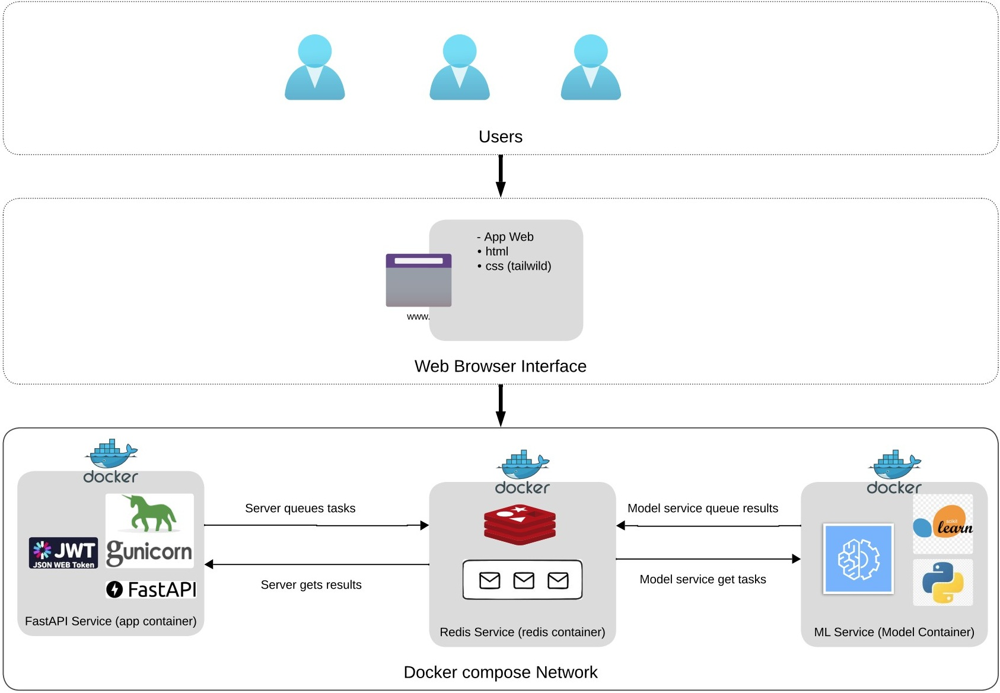

# Credit Risk Analysis Application

## Overview
This application is a Credit Risk Analysis system that uses Machine Learning to predict loan approval based on customer information. The system is built with FastAPI for the backend, Redis for job queuing, and a ML service for predictions.

## Team Tutor - AnyoneAI
- [Diego Garcia Cerdas](https://github.com/diegogcerdas) 

## Team Members
- [Pedro Guale González](https://github.com/Pedronet1997)
- [Carlos Carro](https://github.com/carlosilich)
- [Mario Zamora](https://github.com/MarioZalem)
- [Kevin Ordoñez](https://github.com/Vashomaru) 
- [Joel Andres Solaeche](https://github.com/joelsolaeche) 
- [Miguel Callo Luque](https://github.com/migueluap)

## Architecture

The application follows a microservices architecture pattern using Docker Compose:



### Components:

1. **FastAPI Service (app container)**
   - Handles web interface and user authentication with JWT
   - Processes form submissions and communicates with Redis

2. **Redis Service (redis container)**
   - Acts as message broker between services
   - Stores temporary prediction data and task queue

3. **ML Service (model container)**
   - Loads pre-trained machine learning models
   - Processes prediction requests from Redis queue
   - Returns prediction results

### Data Flow:
1. Users submit loan applications through the web interface
2. FastAPI server queues tasks in Redis
3. ML service retrieves tasks from Redis
4. ML service processes data and returns results to Redis
5. FastAPI retrieves and displays results to users

This architecture allows for scalability and separation of concerns between the web application and machine learning components.


## Project Structure
```
Credit-Risk-App/
├── notebooks/                     # Jupyter notebooks for model development
│   ├── 1_ci_data_cleanup.ipynb     # Data cleaning and preprocessing
│   ├── 2_logistic_regression_model.ipynb  # Logistic Regression model
│   ├── 3_lightgbm_model.ipynb      # LightGBM model implementation
│   ├── 4_xgboost_model.ipynb      # XGBoost model implementation
│   ├── 5_model_pipeline.ipynb        # Model pipeline development
│   └── practice_not_use_to_model/  # Additional experimental notebooks
│
├── src/                         # Source code for the application
│   ├── app/                     # FastAPI web application
│   │   ├── static/             # Static files (CSS, JS, images)
│   │   ├── templates/          # HTML templates
│   │   ├── app.py             # Main FastAPI application
│   │   ├── utils.py           # Utility functions
│   │   ├── models.py          # Data models
│   │   ├── database.py        # Database configurations
│   │   ├── requirements.txt   # App dependencies
│   │   └── Dockerfile         # App container configuration
│   │
│   ├── models/                 # ML model service
│   │   ├── ml_model.py        # Model prediction service
│   │   ├── requirements.txt   # Model dependencies
│   │   └── Dockerfile         # Model container configuration
│   │
│   └── docker-compose.yml      # Multi-container Docker configuration
```

## Model Development
The `notebooks/` directory contains extensive model development work:
- Data cleaning and preprocessing
- Exploratory Data Analysis (EDA)
- Multiple model implementations:
  - Logistic Regression (baseline)
  - Random Forest
  - XGBoost
  - LightGBM
  - SGD Classifier
- Model evaluation and comparison
- Pipeline development

## Features
- **User Authentication**: Secure login system with JWT tokens
- **Interactive Web Interface**: User-friendly form to input customer data
- **Real-time Predictions**: Instant credit risk assessment
- **Microservices Architecture**: 
  - Web Application Service
  - Machine Learning Service
  - Redis Queue Service

## Technical Stack
- **Backend**: FastAPI
- **Machine Learning**: Scikit-learn
- **Queue System**: Redis
- **Authentication**: JWT with OAuth2
- **Frontend**: HTML/CSS with Jinja2 Templates
- **Containerization**: Docker & Docker Compose

## Input Features
The system analyzes various customer attributes including:
- Personal Information (Name, Age, Gender)
- Financial Status (Monthly Income)
- Residence Information
- Payment History
- Assets and Liabilities
- Banking Relationships
- Contact Information

## Installation & Setup

### Prerequisites
- Docker and Docker Compose
- Python 3.8+
- Redis

### Setup Steps
1. Clone the repository
2. Navigate to the `src/` directory
3. Create a virtual environment:
```bash
python -m venv .venv
source .venv/bin/activate  # Linux/Mac
.venv\Scripts\activate     # Windows
```
4. Install dependencies:
```bash
pip install -r requirements.txt
```

### Running with Docker
1. Go to `src/` directory
2. Build the services:
```bash
docker-compose build
```
3. Start the application:
```bash
docker-compose up
```

### Accessing the Application
- Main application: `http://localhost:8000/`
- Login page: `http://localhost:8000/login`

## API Endpoints
- `/`: Home page
- `/login`: User authentication
- `/token`: JWT token generation
- `/index`: Loan prediction form
- `/prediction`: Credit risk analysis results

## Machine Learning Model
- Uses a pre-trained logistic regression model
- Provides probability scores for loan approval
- Model accuracy metrics available in predictions
- Multiple model experiments available in notebooks

## Security Features
- Password hashing with bcrypt
- JWT token-based authentication
- Secure session management
- Environment variable configuration

## Environment Configuration
Required environment variables:
- `REDIS_QUEUE`
- `REDIS_PORT`
- `REDIS_DB_ID`
- `SERVER_SLEEP`
- `SECRET_KEY`
- `ALGORITHM`

## Contributing
1. Fork the repository
2. Create a feature branch
3. Commit your changes
4. Push to the branch
5. Create a Pull Request

## License
This project is licensed under the MIT License - see the LICENSE file for details.
