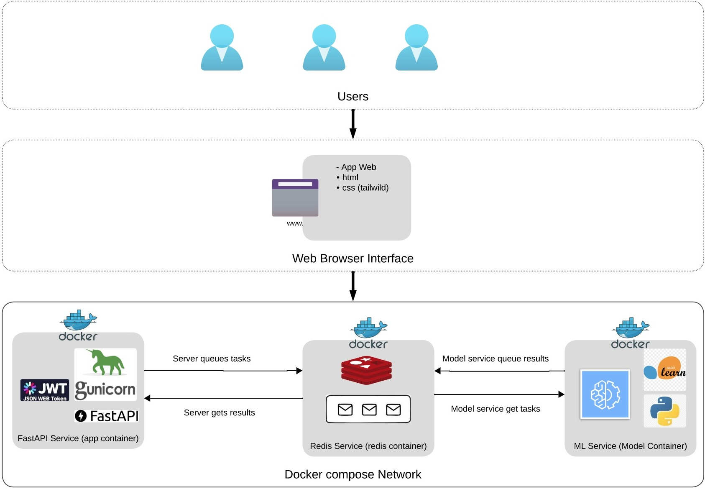

# クレジットリスク分析アプリケーション

## 概要
本アプリケーションは、**顧客情報に基づきローン承認を予測する機械学習ベースのクレジットリスク分析システム**です。  
バックエンドに FastAPI、ジョブキューに Redis、予測処理に ML サービスを利用しています。

---

## チーム - AnyoneAI
**チューター**
- [Diego Garcia Cerdas](https://github.com/diegogcerdas)  

**メンバー**
- [Pedro Guale González](https://github.com/Pedronet1997)  
- [Carlos Carro](https://github.com/carlosilich)  
- [Mario Zamora](https://github.com/MarioZalem)  
- [Kevin Ordoñez](https://github.com/Vashomaru)  
- [Joel Andres Solaeche](https://github.com/joelsolaeche)  
- [Miguel Callo Luque](https://github.com/migueluap)  

---

## アーキテクチャ

本アプリは **Docker Compose を用いたマイクロサービスアーキテクチャ** を採用しています。



### コンポーネント
1. **FastAPI サービス (app コンテナ)**  
   - Webインターフェースと JWT 認証を担当  
   - フォーム送信を処理し Redis と通信  

2. **Redis サービス (redis コンテナ)**  
   - 各サービス間のメッセージブローカー  
   - 一時的な予測データとタスクキューを管理  

3. **ML サービス (model コンテナ)**  
   - 学習済み機械学習モデルをロード  
   - Redis から予測タスクを取得・処理  
   - 結果を返却  

### データフロー
1. ユーザーがWebフォームで申請情報を入力  
2. FastAPI サーバーがタスクを Redis にキューイング  
3. ML サービスが Redis からタスクを取得  
4. ML サービスが予測処理を実行し結果を Redis に返却  
5. FastAPI が結果を取得しユーザーに表示  

この仕組みにより、スケーラブルかつ役割分担が明確な設計になっています。

---

## プロジェクト構成
```
Credit-Risk-App/
├── notebooks/                  # モデル開発用Jupyterノートブック
│   ├── 1_ci_data_cleanup.ipynb   # データクリーニング
│   ├── 2_logistic_regression_model.ipynb  # ロジスティック回帰
│   ├── 3_lightgbm_model.ipynb   # LightGBMモデル
│   ├── 4_xgboost_model.ipynb    # XGBoostモデル
│   ├── 5_model_pipeline.ipynb   # モデルパイプライン
│   └── practice_not_use_to_model/ # 実験用ノートブック
│
├── src/                       # アプリケーション本体
│   ├── app/                   # FastAPI アプリ
│   ├── models/                # MLモデルサービス
│   └── docker-compose.yml     # マルチコンテナ構成
```
---

## モデル開発
- データクリーニング・前処理  
- 探索的データ分析 (EDA)  
- 複数モデルを実装・比較  
  - ロジスティック回帰 (ベースライン)  
  - ランダムフォレスト  
  - XGBoost  
  - LightGBM  
  - SGD Classifier  
- モデル評価とパイプライン構築  

---

## 機能
- **ユーザー認証**: JWT を用いたセキュアログイン  
- **直感的なWebフォーム**: 顧客データ入力用UI  
- **リアルタイム予測**: 即時クレジットリスク判定  
- **マイクロサービス構成**: Web / ML / Redis サービス分離  

---

## 技術スタック
- **バックエンド**: FastAPI  
- **機械学習**: Scikit-learn  
- **キューシステム**: Redis  
- **認証**: JWT + OAuth2  
- **フロントエンド**: HTML/CSS (Jinja2テンプレート)  
- **コンテナ**: Docker & Docker Compose  

---

## 分析対象となる顧客情報
- 基本情報（氏名、年齢、性別）  
- 金融状況（月収など）  
- 居住情報  
- 支払い履歴  
- 資産・負債情報  
- 銀行取引履歴  
- 連絡先情報  

---

## セットアップ方法

### 必要環境
- Docker & Docker Compose  
- Python 3.8+  
- Redis  

### 手順
1. リポジトリをクローン  
2. `src/` ディレクトリへ移動  
3. 仮想環境を作成して依存関係をインストール  
4. Docker でビルド & 起動  

```bash
docker-compose build
docker-compose up
```

- アプリ: `http://localhost:8000/`  
- ログイン: `http://localhost:8000/login`  

---

## API エンドポイント
- `/`: ホーム  
- `/login`: ユーザー認証  
- `/token`: JWTトークン発行  
- `/index`: ローン申請フォーム  
- `/prediction`: クレジットリスク判定結果  

---

## 機械学習モデル
- ロジスティック回帰モデルを利用  
- 承認確率をスコアとして出力  
- モデル精度は予測結果と共に表示  
- ノートブックで他モデル実験も実施済み  

---

## セキュリティ機能
- bcryptによるパスワードハッシュ化  
- JWTトークン認証  
- 安全なセッション管理  
- 環境変数による設定  

---

## 環境変数
- `REDIS_QUEUE`  
- `REDIS_PORT`  
- `REDIS_DB_ID`  
- `SERVER_SLEEP`  
- `SECRET_KEY`  
- `ALGORITHM`  

---

## コントリビューション
1. リポジトリをフォーク  
2. ブランチを作成  
3. 修正をコミット  
4. プッシュして PR を作成  

---

## ライセンス
本プロジェクトは MIT ライセンスの下で公開されています。  
